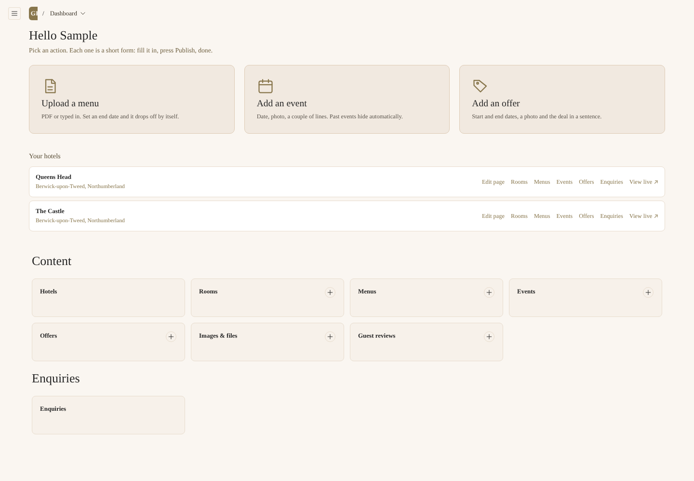
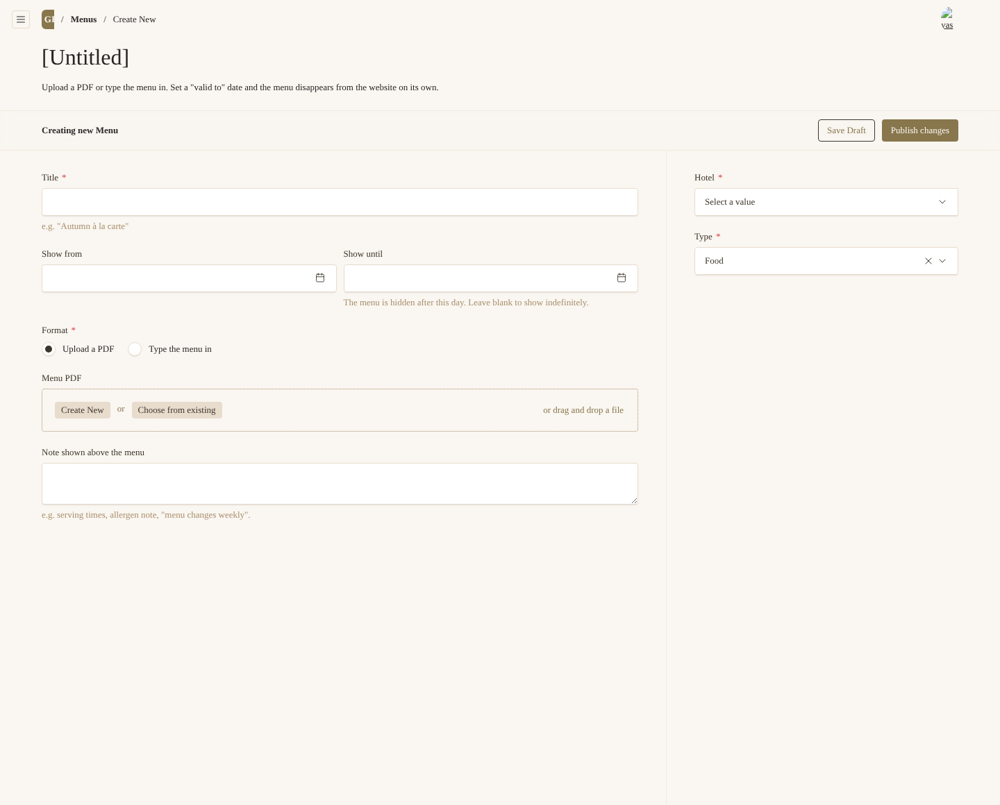

# GR Hotels website: manager guide

One page. Three jobs. Screenshots are in the `docs/screenshots` folder and will be refreshed once the site is live.

## Logging in

1. Go to **www.grhotels.co.uk/admin** (on the preview site, add `/admin` to the preview address).
2. Enter your email and password. Forgotten it? Click **Forgot password** and follow the email.
3. You land on your dashboard. It shows your hotel (or hotels) and three big buttons.

You only see your own hotel's content. Nothing you do can affect another hotel or the group pages.

---

## 1. Upload a menu

**Dashboard → Upload a menu**

| Field | What to put |
|---|---|
| Title | What guests would call it, e.g. "Autumn à la carte" or "Christmas party menu" |
| Hotel | Already filled in if you look after one hotel |
| Type | Food, Drinks, Breakfast, Sunday lunch, Afternoon tea, Christmas, Specials, Children, Other |
| Show from / Show until | Optional. Set **Show until** on anything seasonal and the menu disappears from the website on that day. It stays in the admin. |
| Upload a PDF *or* Type the menu in | PDF is quickest. Typing it in looks nicer on phones and lets you tick V, VG, GF, DF, N against each dish. |
| Note | Serving times, allergen note, "menu changes weekly" |

Press **Publish**. The hotel's Dining page updates within a minute.

To replace a menu, open it from **Menus**, upload the new PDF (or edit the dishes) and press **Publish** again. Old versions are kept under **Versions** if you ever need to go back.

---

## 2. Add an event

**Dashboard → Add an event**

| Field | What to put |
|---|---|
| Title | "Live music with The Hollow Hills", "Mother's Day lunch" |
| Starts / Ends | Date and time. Ends is optional. |
| Image | Landscape photo. You will be asked for a one-line description (alt text): say what is in the picture. |
| Summary | One or two sentences. This is what shows on the card. |
| Full details | Anything else: line-up, menu, dress code |
| Price | "Free entry", "£45 per person" |
| Ticket or booking link | Paste a link if people book somewhere else. Otherwise guests get an **Enquire** button that emails you. |

Press **Publish**. Past events vanish from the website by themselves the day after they end.

---

## 3. Add an offer

**Dashboard → Add an offer**

| Field | What to put |
|---|---|
| Title | "Dinner, bed & breakfast from £129" |
| Image | Required. Landscape. |
| Summary | The deal in one or two sentences |
| Details and terms | Blackout dates, minimum stay, how to claim |
| Show from / Show until | **Show until is required.** The offer disappears on that day. |
| Promo code | Optional |
| Button link | Leave blank and the button uses your hotel's normal booking link |

Press **Publish**.

---

## Everyday tips

- **Save draft vs Publish.** Save draft keeps it private. Publish puts it live. The **Preview** button shows the page before anyone else sees it.
- **Made a mistake?** Open the item, click **Versions** in the top right, pick an earlier one and **Restore**.
- **Photos.** Phone photos are fine if they are sharp and well lit. Landscape for heroes and cards. Under 10 MB. The site resizes and compresses them for you. Drag the dot on the preview to choose the focal point so faces are not cropped on phones.
- **Alt text.** Every photo needs a short description. "Double bedroom with garden view" is perfect. It helps blind visitors and Google.
- **Your hotel page.** Under **Hotels → your hotel → Page content** you can add, remove and drag blocks (text, gallery, FAQ and so on). Each block has a background tone, spacing and alignment. There are no colour or font choices to get wrong.
- **Enquiries.** Contact form messages are emailed to the hotel and also listed under **Enquiries**, so nothing gets lost. Mark them Replied or Closed as you go.
- **Rooms.** Edit room names, prices, photos and descriptions under **Rooms**. Room photos need at least one image.
- **Something you cannot change** (the hotel name, web address, booking link or enquiry email)? Those are set by head office. Ask the admin.

## Need help?

Email the site admin at info@grhotels.co.uk with the hotel name and what you were trying to do. A screenshot helps.
